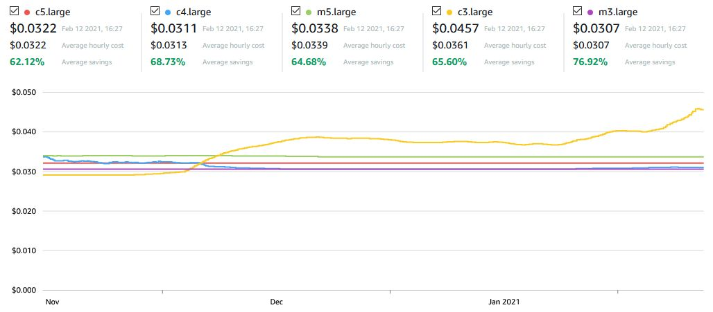

# Sólarsteinn
Sólarsteinn is a framework for running a Valheim dedicated server on pre-emptible public cloud instances (AWS Spot). The word refers to the legendary sunstones, which the vikings supposedly used to find the sun through clouds while navigating under a completely overcast sky. 

## Goals: 
The goal is to get an affordable, automated, and stable dedicated server running on public clouds that competes in cost with dedicated server offerings from game companies. It's relatively easy to get a dedicated server set up on a unix host, but on-demand pricing for a capable enough server is high ($40+ a month). One way to get around that is to use spot instances, which vary in price based on bids on extra capacity. For a spot-based server, the server has to gracefully handle shutdowns and restarts.

This server should:

- Be completely automated to set up / configure

- Cost the same or less than equivalent dedicated servers from game hosting companies
- Stably support up to 10 players for a reasonable amount of playtime (~8h) per day
- Have some mechanism to backup data on a regular basis
- Require little to no no human interaction to maintain once set up
  - Update on a regular basis
  - Handle service interruptions gracefully (especially with spot/pre-emptible instances)
- Automate part-time uptime

## Current competing STC/STG offerings:
*TODO make this into a table*
- CitadelServers
- SecretServers
- GPortal
- GTXgaming

## Cost components
Actual cost to run the server is more than just server uptime itself.
- Compute instance uptime
- EBS (hard drive) capacity
  - Root volume
  - Detachable (persistent) game volume
- Snapshot (backup) storage
- Network throughput (data transfer)
- Elastic IP

## Instance types
Valheim dedicated server requires at least 2 CPUs and 4GB RAM. 

- Is a tX.medium sufficient? Probably not
  - With 4 or 7h of CPU burst credits per day, will we hit burst limit?
    - What is baseline CPU usage like? Some users report 100% utilization of a single core as baseline
    - Users are reporting on reddit that they quickly hit the burst limit and are throttled to 20%
  - If we upgrade, do we go for a cX.large (2CPUx4GB) or a mX.large (2CPUx8GB) - roughly the same price, slightly better cpu in the C series. Probably the mX
- How does resource impact scale with # of players?
- Hard drive space ($0.10/GB/mo)
  - 2GB baseline for server installation, how does this scale/grow with world exploration
  - How much breathing room for updates? Does steamcmd purge old files?
  - Can grow a volume but not easily shrink it (especially in the context of spot instances) - start small
- Region
  - Which west coast region has the best spot pricing for relevant instances? 
  - How much does ping matter - do we go usw2 by default just to optimize connectivity?
- IP
  - Need a static IP attached to the server at each boot so that users don't have to rotate




## Architecture
### Containerization vs. static volume
#### Containers
- May be annoying to update
- I don't like docker ughhhhh but I guess I should
- Carry additional performance/space overhead. 
- Easier to migrate to other services/hosts
- Easier to orchestrate through pre-emptions/downtime without custom devops scripting.

#### Static volume attached to instance
- Easy to attach/detach 
- Easy to snapshot for backups
- Tied to AWS, harder to migrate to a new server
- Base AMI will have to be routinely updated with dependencies (necessitating packer and $$ for AMI storage)

#### Static root volume

- Easiest to set up
- Snapshottable
- Harder to migrate, necessitating new setups

### Control scheme

#### Orchestration/configuration

Ansible and manual deployment?

use LGSM for deployment/management? https://linuxgsm.com/lgsm/vhserver/

use an existing docker container? https://github.com/lloesche/valheim-server-docker (or many others)

Nimdy's installation scripts? https://github.com/Nimdy/Dedicated_Valheim_Server_Script

#### Necessary scripts if building myself

- From controller
  - Start instance
  - Stop instance
  - Attach and mount EBS
- On server
  - Initial installation helpers (optional)
    - Install server components
    - Install world from existing save
    - Swap between multiple worlds? (bonus feature - config file?)
  - Start server
  - Save world
  - Take down server
  - Update server
  - Wrapper: save world, take down (pre-emption response)
  - Wrapper: save world, take down, update, start (update)

## Setup notes

Set up a vpc with public subnet in us-west-2b

provision a spot instance (m5.large) with a 20gb EBS attached as root volume at start. Persistent.

use keypair valheim.pem

create and associate elastic IP

Set up backup lifecycle policy for EBS volume (4h/4d) (TODO: just use rsync backups of world moving forward rather than whole volume snapshots)

Log in and apt-get update/upgrade

install vhserver dependencies

Ubuntu

```
sudo dpkg --add-architecture i386
sudo apt update
sudo apt install -y curl wget file tar bzip2 gzip unzip bsdmainutils python util-linux ca-certificates binutils bc jq tmux netcat lib32gcc1 lib32stdc++6 steamcmd libsdl2-2.0-0:i386
sudo apt install -y rclone
```

Centos/awslinux

```
yum install -y epel-release
yum install -y curl wget tar bzip2 gzip unzip python3 binutils bc jq tmux glibc.i686 libstdc++ libstdc++.i686
yum install -y rclone
```

create server user (with a server password)

```
sudo adduser vhserver
su - vhserver
```

use lgsm to install vhserver

```
wget -O linuxgsm.sh https://linuxgsm.sh && chmod +x linuxgsm.sh && bash linuxgsm.sh vhserver
./vhserver install
```

edit configs in /home/vhserver/lgsm/config-lgsm/vhserver

## Setup notes for running solarsteinn on a greengrass acct

### Prior to running Solarsteinn

**Disclaimer:** Creating resources and using bandwidth in AWS will incur monetary charges. You are running this tool at your own risk! Additionally, this stack implements some basic security measures, but you are responsible for maintaining the security of your own server(s).

#### Creating an AWS account

In order to run Solarsteinn, you'll need an AWS account. If you're reading this guide and don't happen to have AWS experience, you can follow Amazon's [guide to setting up an AWS account](https://aws.amazon.com/premiumsupport/knowledge-center/create-and-activate-aws-account/). 

There are many basic security practices that should be followed when using AWS. One of them is never to use your root keypair. Please use an [IAM user keypair](https://docs.aws.amazon.com/IAM/latest/UserGuide/best-practices.html) with the appropriate permissions (TODO) to run the various components of this framework.

#### Prerequisites

In order to create and connect to the server, you'll need the following already set up:

- A public-private SSH keypair
  - This has to be either created in AWS or registered with AWS - please follow the [AWS guide](https://docs.aws.amazon.com/AWSEC2/latest/UserGuide/ec2-key-pairs.html) with the method you're most comfortable with, and keep your keypair private/safe.
- 


### references

#### vpc and server

https://docs.aws.amazon.com/AWSCloudFormation/latest/UserGuide/sample-templates-services-us-west-2.html#w2ab1c35c58c13c41

https://muhannad0.github.io/post/cloudformation-and-ansible-provision-and-configure/

